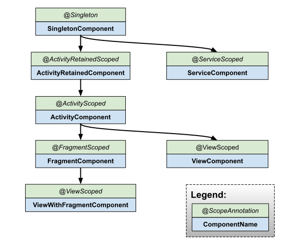

**Note:** The following page assumes a basic knowledge of Dagger, including
components, modules, scopes, and bindings. (For a refresher, see
[Dagger users guide](https://dagger.dev/dev-guide).)
{: .c-callouts__note }

## Component hierarchy

Unlike traditional Dagger, Hilt users never define or instantiate Dagger
components directly. Instead, Hilt offers predefined components that are
generated for you. Hilt comes with a built-in set of components (and
corresponding scope annotations) that are automatically integrated into the
various lifecycles of an Android application. The diagram below shows the
standard Hilt component hierarchy. The annotation above each component is the
scoping annotation used to scope bindings to the lifetime of that component. The
arrow below a component points to any child components. As normal, a binding in
a child component can have dependencies on any binding in an ancestor component.

**Note:** When scoping a binding within an `@InstallIn` module, the scope on the
binding must match the [scope of the component](#component-lifetimes). For
example, a binding within an `@InstallIn(ActivityComponent.class)` module can
only be scoped with `@ActivityScoped`.
{: .c-callouts__note }

[Dagger docs]:https://dagger.dev/subcomponents#subcomponents-and-scope




## Component members injection

The [`@AndroidEntryPoint`](android-entry-point.md) section shows how to inject
your Android classes using members injection. The Hilt components are the ones
responsible for injecting their bindings into your Android classes. Each
component is responsible for injecting a different type of Android class. This
is shown in the table below:

Component                       | Injector for
------------------------------- | ----------------------------------------
**`ApplicationComponent`**      | `Application`
**`ActivityRetainedComponent`** | `ViewModel` (see [View model extension])
**`ActivityComponent`**         | `Activity`
**`FragmentComponent`**         | `Fragment`
**`ViewComponent`**             | `View`
**`ViewWithFragmentComponent`** | `View` with `@WithFragmentBindings`
**`ServiceComponent`**          | `Service`

[View model extension]: https://developer.android.com/training/dependency-injection/hilt-jetpack

## Component lifetimes

The lifetime of a component is important because it relates to the lifetime of
your bindings in two important ways:

1.  It bounds the lifetime of scoped bindings between when the component is
    created and when it is destroyed.
2.  It indicates when members injected values can be used (e.g. when `@Inject`
    fields are not null).

Component lifetimes are generally bounded by the creation and destruction of a
corresponding instance of an Android class. The table below lists the scope
annotation and bounded lifetime for each component.

Component                       | Scope                    | Created at                | Destroyed at
------------------------------- | ------------------------ | ------------------------- | ------------
**`ApplicationComponent`**      | `@Singleton`             | `Application#onCreate()`  | `Application#onDestroy()`
**`ActivityRetainedComponent`** | `@ActivityRetainedScope` | `Activity#onCreate()`[^1] | `Activity#onDestroy()`[^1]
**`ActivityComponent`**         | `@ActivityScoped`        | `Activity#onCreate()`     | `Activity#onDestroy()`
**`FragmentComponent`**         | `@FragmentScoped`        | `Fragment#onAttach()`     | `Fragment#onDestroy()`
**`ViewComponent`**             | `@ViewScoped`            | `View#super()`            | `View` destroyed
**`ViewWithFragmentComponent`** | `@ViewScoped`            | `View#super()`            | `View` destroyed
**`ServiceComponent`**          | `@ServiceScoped`         | `Service#onCreate()`      | `Service#onDestroy()`

[^1]: `ActivityRetainedComponent` lives across configuration changes, so it is
    created at the first onCreate and last onDestroy.


#### Scoped vs unscoped bindings

By default, all bindings in Dagger are "unscoped". This means that each time the
binding is requested, Dagger will create a new instance of the binding.

However, Dagger also allows a binding to be "scoped" to a particular component
(see the scope annotations in the table above). A scoped binding will only be
created once per instance of the component it's scoped to, and all requests for
that binding will share the same instance.

Example:

<div class="c-codeselector__button c-codeselector__button_java">Java</div>
<div class="c-codeselector__button c-codeselector__button_kotlin">Kotlin</div>
```java
// This binding is "unscoped".
// Each request for this binding will get a new instance.
final class UnscopedBinding {
  @Inject UnscopedBinding() {}
}

// This binding is "scoped".
// Each request from the same component instance for this binding will
// get the same instance. Since this is the fragment component, this means
// each request from the same fragment.
@FragmentScoped
final class ScopedBinding {
  @Inject ScopedBinding() {}
}
```
{: .c-codeselector__code .c-codeselector__code_java }
```kotlin
// This binding is "unscoped".
// Each request for this binding will get a new instance.
class UnscopedBinding @Inject constructor() {
}

// This binding is "scoped".
// Each request from the same component instance for this binding will
// get the same instance. Since this is the fragment component, this means
// each request from the same fragment.
@FragmentScoped
class ScopedBinding @Inject constructor() {
}
```
{: .c-codeselector__code .c-codeselector__code_kotlin }

**Warning:** A common misconception is that all fragment instances will share the
same instance of a binding scoped with `@FragmentScoped`. However, this is not
true. Each fragment instance gets a new instance of the fragment component, and
thus a new instance of all its scoped bindings.
{: .c-callouts__warning }

#### Scoping in modules

The previous section showed how to scope a binding declared with an `@Inject`
constructor, but a binding declared in a module can also be scoped in a similar
way.

Example:

<div class="c-codeselector__button c-codeselector__button_java">Java</div>
<div class="c-codeselector__button c-codeselector__button_kotlin">Kotlin</div>
```java
@Module
@InstallIn(FragmentComponent.class)
abstract class FooModule {
  // This binding is "unscoped".
  @Provides
  static UnscopedBinding provideUnscopedBinding() {
    return new UnscopedBinding();
  }

  // This binding is "scoped".
  @Provides
  @FragmentScoped
  static ScopedBinding provideScopedBinding() {
    return new ScopedBinding();
  }
}
```
{: .c-codeselector__code .c-codeselector__code_java }
```kotlin
@Module
@InstallIn(FragmentComponent.class)
object FooModule {
  // This binding is "unscoped".
  @Provides
  fun provideUnscopedBinding() = UnscopedBinding()

  // This binding is "scoped".
  @Provides
  @FragmentScoped
  fun provideScopedBinding() = ScopedBinding()
}
```
{: .c-codeselector__code .c-codeselector__code_kotlin }

**Warning:** A common misconception is that all bindings declared in a module will
be scoped to the component the module is installed in. However, this isn't true.
Only bindings declarations annotated with a scope annotation will be scoped.
{: .c-callouts__warning }

#### When to scope?

Scoping a binding has a cost on both the generated code size and its runtime
performance so use scoping sparingly. The general rule for determining if a
binding should be scoped is to only scope the binding if it's required for the
correctness of the code. If you think a binding should be scoped for purely
performance reasons, first verify that the performance is an issue, and if it is
consider using `@Reusable` instead of a component scope.


## Component default bindings {#component-bindings}

Each Hilt component comes with a set of default bindings that can be injected
as dependencies into your own custom bindings.

Component                       | Default Bindings
------------------------------- | ---------------------------------------------
**`ApplicationComponent`**      | `Application`[^2]
**`ActivityRetainedComponent`** | `Application`
**`ActivityComponent`**         | `Application`, `Activity`
**`FragmentComponent`**         | `Application`, `Activity`, `Fragment`
**`ViewComponent`**             | `Application`, `Activity`, `View`
**`ViewWithFragmentComponent`** | `Application`, `Activity`, `Fragment`, `View`
**`ServiceComponent`**          | `Application`, `Service`

[^2]: The `Application` binding is available using either `@ApplicationContext
    Context` or `@ApplicationContext Application`.
