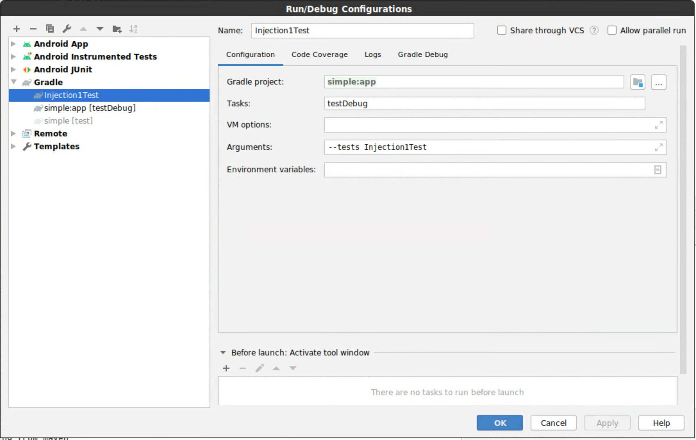

## Hilt dependencies

To use Hilt, add the following build dependencies to the Android Gradle module's
`build.gradle` file:

```groovy
dependencies {
  implementation 'com.google.dagger:hilt-android:<VERSION>'
  annotationProcessor 'com.google.dagger:hilt-android-compiler:<VERSION>'

  // For instrumentation tests
  androidTestImplementation  'com.google.dagger:hilt-android-testing:<VERSION>'
  androidTestAnnotationProcessor 'com.google.dagger:hilt-android-compiler:<VERSION>'

  // For local unit tests
  testImplementation 'com.google.dagger:hilt-android-testing:<VERSION>'
  testAnnotationProcessor 'com.google.dagger:hilt-android-compiler:<VERSION>'
}
```

## Using Hilt with Kotlin

If using Kotlin, then apply the
[kapt plugin](https://kotlinlang.org/docs/reference/kapt.html) and declare the
compiler dependency using `kapt` instead of `annotationProcessor`.

Additionally configure kapt to correct error types by setting
[`correctErrorTypes`](https://kotlinlang.org/docs/reference/kapt.html#non-existent-type-correction)
to true.

```groovy
dependencies {
  implementation 'com.google.dagger:hilt-android:<VERSION>'
  kapt 'com.google.dagger:hilt-android-compiler:<VERSION>'

  // For instrumentation tests
  androidTestImplementation  'com.google.dagger:hilt-android-testing:<VERSION>'
  kaptAndroidTest 'com.google.dagger:hilt-android-compiler:<VERSION>'

  // For local unit tests
  testImplementation 'com.google.dagger:hilt-android-testing:<VERSION>'
  kaptTest 'com.google.dagger:hilt-android-compiler:<VERSION>'
}

kapt {
 correctErrorTypes true
}
```

## Hilt Gradle plugin {#hilt-gradle-plugin}

The Hilt Gradle plugin runs a bytecode transformation to make the APIs easier to
use. The plugin was created for a better developer experience in the IDE since
the generated class can disrupt code completion for methods on the base class.
The examples throughout the docs will assume usage of the plugin. To configure
the Hilt Gradle plugin first declare the dependency in your project's root
`build.gradle` file:

<!-- TODO(user): Add .kts (kotlin scripting) code blocks. -->

```groovy
buildscript {
  repositories {
    // other repositories...
    mavenCentral()
  }
  dependencies {
    // other plugins...
    classpath 'com.google.dagger:hilt-android-gradle-plugin:<version>'
  }
}
```

then in the `build.gradle` of your Android Gradle modules apply the plugin:

```groovy
apply plugin: 'com.android.application'
apply plugin: 'dagger.hilt.android.plugin'

android {
  // ...
}
```

**Warning:** The Hilt Gradle plugin sets annotation processor arguments. If you
are using other libraries that require annotation processor arguments, make sure
you are adding arguments instead of overriding them. See
[below](#applying-other-processor-arguments) for an example.
{: .c-callouts__warning }

### Why use the plugin? {#why-use-the-plugin}

One of the main benefits of the Gradle plugin is that it makes using
`@AndroidEntryPoint` and `@HiltAndroidApp` easier. Without the Gradle plugin,
the base class must be specified in the annotation and the annotated class must
extend the generated class:

<div class="c-codeselector__button c-codeselector__button_java">Java</div>
<div class="c-codeselector__button c-codeselector__button_kotlin">Kotlin</div>
```java
@HiltAndroidApp(MultiDexApplication.class)
public final class MyApplication extends Hilt_MyApplication {}
```
{: .c-codeselector__code .c-codeselector__code_java }
```kotlin
@HiltAndroidApp(MultiDexApplication::class)
class MyApplication : Hilt_MyApplication()
```
{: .c-codeselector__code .c-codeselector__code_kotlin }

With the Gradle plugin the annotated class can extend the base class directly:

<div class="c-codeselector__button c-codeselector__button_java">Java</div>
<div class="c-codeselector__button c-codeselector__button_kotlin">Kotlin</div>
```java
@HiltAndroidApp
public final class MyApplication extends MultiDexApplication {}
```
{: .c-codeselector__code .c-codeselector__code_java }
```kotlin
@HiltAndroidApp
class MyApplication : MultiDexApplication()
```
{: .c-codeselector__code .c-codeselector__code_kotlin }

### Local test configuration {#gradle-plugin-local-tests}

By default, the plugin will transform *instrumented* test classes (usually
located in the `androidTest` source folder), but an additional configuration is
required for the plugin to transform *local jvm* tests (usually located in
the `test` source folder).

To enable transforming `@AndroidEntryPoint` classes in local jvm tests, apply
the following configuration in your module's `build.gradle`:

```
hilt {
    enableTransformForLocalTests = true
}
```

**Warning:** The `enableTransformForLocalTests` configuration only works when
running from the command line, e.g. `./gradlew test`. It does not work when
running tests with Android Studio (via the play button in the test method or
class). See [Running tests with Android Studio](#running-with-android-studio)
for more information and possible work arounds.
{: .c-callouts__warning }

### Running tests with Android Studio {#running-with-android-studio}

The [`enableTransformForLocalTests`](#gradle-plugin-local-tests) configuration
does not work when running tests with Android Studio (via the play button in the
test method or class) because the tasks used by Android Studio to run the tests
ignore the transformed test class. This is something we are working with the
Android Gradle Plugin team to fix
([b/37076369](https://issuetracker.google.com/37076369)).

In the meantime, there are a few options to work around the issue.

The first option is to avoid running Robolectric tests via Android Studio.
Instead, run the tests through Gradle, typically via `./gradlew test` or
`./gradlew testDebug`.

The second option, is to create your own Android Studio configuration that
executes tests via the Gradle task. To do this, create a new 'Run Configuration'
of type 'Gradle' from within Android Studio with the following parameters:

  1. `Gradle project`: the Gradle module where the tests are located
  2. `Task`: the test task (usually either `test` or `testDebug`)
  3. `Arguments`: the list of tests (e.g. `--tests MyTestClassSee`)

As an example, see the setup below:



The third option is to avoid using the [Hilt Gradle plugin](#hilt-gradle-plugin)
until [b/37076369](https://issuetracker.google.com/37076369) is fixed.

### Applying other processor arguments {#applying-other-processor-arguments}

The Hilt Gradle plugin sets annotation processor arguments. If you are using
other libraries that require annotation processor arguments, make sure you are
adding arguments instead of overriding them.

For example, the following notably uses `+=` to avoid overriding the Hilt
arguments.

```groovy
javaCompileOptions {
  annotationProcessorOptions {
    arguments += ["foo" : "bar"]
  }
}
```

If the `+` is missing and `arguments` are overridden, it is likely Hilt will
fail to compile with errors like the following: `Expected @HiltAndroidApp to
have a value. Did you forget to apply the Gradle Plugin?`
